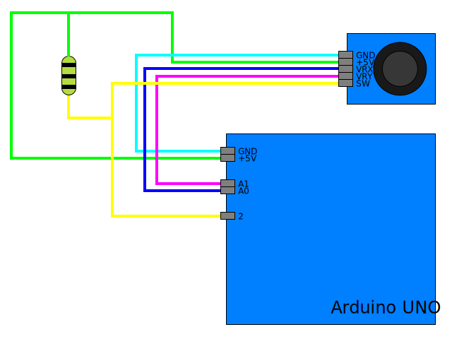

# A joystick library for Arduino Uno

This is a joystick library to get values of axis and button.

## Documentation

```cpp
// Create Joystick Object with
Joystick(int rx_pin, int ry_pin, int button_pin);
// or
Joystick(int rx_pin, int ry_pin, int button_pin, int dead_zone);

// Get axis values
int Joystick::get_x_axis(void); // of x
int Joystick::get_y_axis(void); // of y

// Get button state
bool Joystick::get_button_state(void);

// Handle button events
void Joystick::button_loop(void (*press)(void), void (*release)(void));
```

## Wiring Diagram

<center>



</center>

## License

> This library licensed by MIT-License.